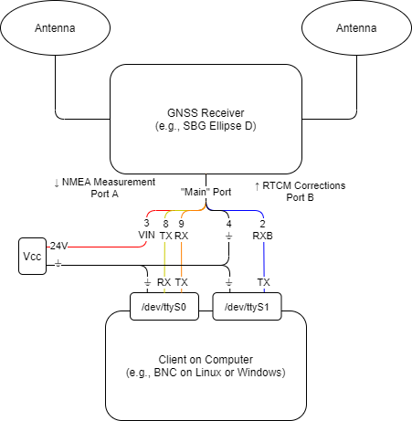
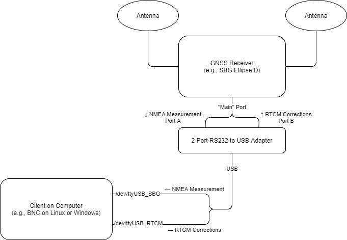
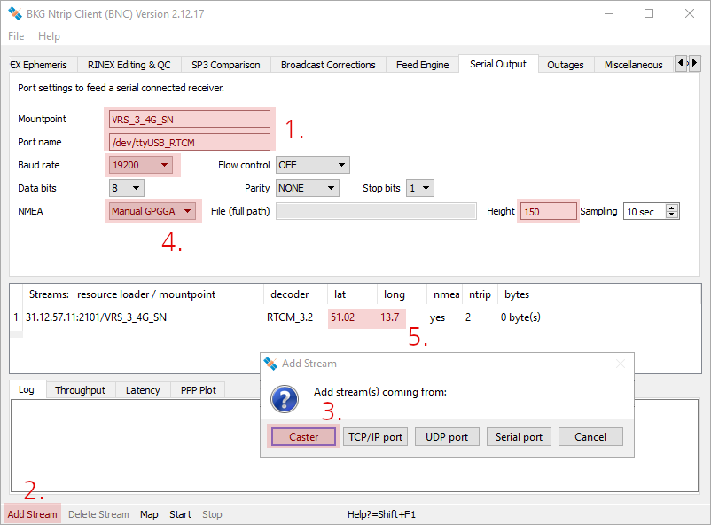
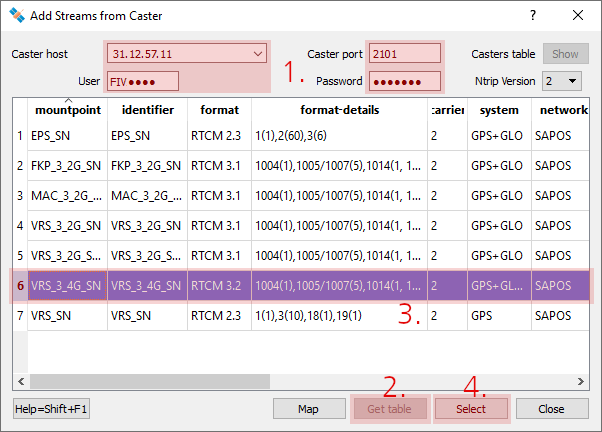
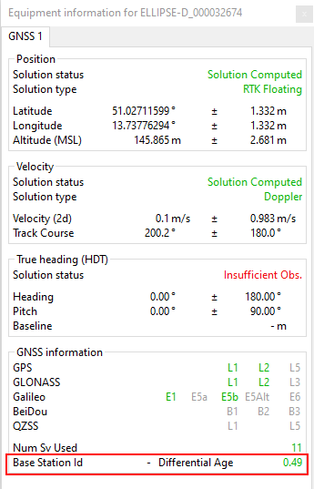

# SBG Ellipse D GPS with NTRIP/SAPOS correction data
The SBG Ellipse D comes with a [ROS driver](https://github.com/SBG-Systems/sbg_ros_driver) which allows to aquire IMU and GPS data. To use NTRIP correction data from the internet, the [BKG Ntrip Client (BNC)](https://igs.bkg.bund.de/ntrip/bnc) can be used to download correction data for a virtual base station in proximity to your application from a SAPOS service provider.

To do so, one serial port (typically Port B) of the SBG GNSS receiver is used to receive RTCM correction data from a computer, while another port (typically Port A) is used to acquire the corrected position measurements with high update rates.

## Wiring with serial ports
Example setup with CA-ELI-RS232-CAN-3M-cable color code (see [page 49 of the SBG Ellipse hardware manual](https://support.sbg-systems.com/sc/el/latest/documentations-resources)):


1. Enable Port B with an appropriate Baud rate, e.g., using sbgCenter included in the [SBG Intertial SDK for Windows](https://support.sbg-systems.com/sc/dev/latest/inertial-sdk)
1. Allow current user to access serial ports on Linux: `sudo adduser $USER dialout`

## Wiring using an RS232-USB-adapter


For setup without dedicated RS232 ports, attach a split cable to your SBG device with two FTDI USB controllers, e.g., by assembling a cable (see [page 49 of the SBG Ellipse hardware manual](https://support.sbg-systems.com/sc/el/latest/documentations-resources)) for use with a 2-Port-RS232-to-USB-Adapter. Make sure to have _PORT A RS232 TX_ connected to your RS232 adapter's first port RX pin and _PORT A RS232 RX_ to the TX pin. _PORT B RX/SYNC IN B_ should be connected to the adapter's second port TX pin (see [Ellipse hardware manual page 23ff](https://support.sbg-systems.com/sc/el/latest/documentations-resources)).

In order to setup your system with persistent port names independent of USB port and plugging order, create the following udev rules on Linux:
1. Enable Port B with an appropriate Baud rate, e.g., using sbgCenter included in the [SBG Intertial SDK for Windows](https://support.sbg-systems.com/sc/dev/latest/inertial-sdk)
1. Allow current user to access serial ports on Linux: `sudo adduser $USER dialout`
1. Identify ports (e.g., `/dev/ttyUSB0`) to which SBG device (_FTDI USB Serial Device converter_) is connected using `dmesg | grep tty`
1. Identify `ATTRS{idVendor}`, `ATTRS{idProduct}` and `ATTRS{serial}` with `udevadm info --name=/dev/ttyUSB0 --attribute-walk` on the ports you just identified
1. Create `/etc/udev/rules.d/20_FTDI_Serial.rules` with the following content to store the interface number for later use:
    ```
    SUBSYSTEMS=="usb", ENV{ID_USB_INTERFACE_NUM}="$attr{bInterfaceNumber}"
    ```
1. Create `/etc/udev/rules.d/21_SBG_Ellipse_FTDI.rules` with the following content adapted to your device parameters:
    ```
    SUBSYSTEM=="tty", SUBSYSTEMS=="usb",  ATTRS{idVendor}=="0403", ATTRS{idProduct}=="6010", ATTRS{serial}=="FT5NRNN2", ENV{ID_USB_INTERFACE_NUM}=="00", SYMLINK+="ttyUSB_SBG"
    SUBSYSTEM=="tty", SUBSYSTEMS=="usb",  ATTRS{idVendor}=="0403", ATTRS{idProduct}=="6010", ATTRS{serial}=="FT5NRNN2", ENV{ID_USB_INTERFACE_NUM}=="01", SYMLINK+="ttyUSB_RTCM"
    ```
1. Restart udev deamon: `/etc/init.d/udev restart`

## Install or build BNC
Install [BKG Ntrip Client (BNC)](https://igs.bkg.bund.de/ntrip/bnc) or build it yourself if the available builds do not work for your plattform (`cannot execute binary file: Exec format error` on Nvidia Jetson or similar):
1. Install dependencies: `sudo apt-get update && sudo apt-get install qt4-default libqtwebkit4 libssl1.0-dev build-essentials`
1. Download source: `wget https://igs.bkg.bund.de/root_ftp/NTRIP/software/bnc-2.12.18-source.zip`
1. Extract source archive: `unzip bnc-2.12.18-source.zip`
1. Change into source directory: `cd bnc-2.12.18-source`
1. Run
    ```
    qmake bnc.pro
    make
    ```
1. Start program: `./bnc`

## Configure BNC
Configure the _Serial Output_ tab of BNC:


1. Use the mountpoint of your HEPS Ntrip-caster (e.g., found in the [SAPOS Technical FAQ](https://zentrale-stelle-sapos.de/technik-faq/) or in the instructions you have received upon registration) and your RTCM port (e.g., `/dev/ttyS1` or `/dev/ttyUSB_RTCM`) with the Baud rate chosen in the configuration of your SBG device
1. Click **Add Stream** at the bottom of the window
1. Add a **Caster** stream

    
    1. Enter IP, port, username and password for your SAPOS provider
    1. Click **Get table**
    1. Select a preferred stream
    1. Confirm
1. Configure NMEA to _Manual GPGGA_ and enter your elevation data
1. If your SBG device does not provide coarse position data on the serial port, manually enter nearby coordindates for your virtual base station (_VRS_)
1. Click **Start** at the bottom of the window

### Verify setup
To test your wiring and Ntrip configuration, connect your device with the sbgCenter included in the [SBG Inertial SDK for Windows](https://support.sbg-systems.com/sc/dev/latest/inertial-sdk) and verify that the differential age in the raw GPS info tab is low:



### Autostart BNC in no-window-mode
To start BNC in no-window-mode, use the following command from a Linux terminal:
```
bnc --nw --key autoStart 2
```

## Configure SBG device
Check your SBG device configuration (e.g., using sbgCenter in the [SBG Intertial SDK for Windows](https://support.sbg-systems.com/sc/dev/latest/inertial-sdk)) or flash a config using ROS ([`ellipse_N_default.yaml`](https://github.com/SBG-Systems/sbg_ros_driver/blob/master/config/example/ellipse_N_default.yaml) works for single rover GPS data acquisition)

## Data acquisition with ROS
Run `roslaunch sbg_gps_launch sbg_gps_bringup.launch`

## Resources
- Application for a SAPOS user account in the state of Saxony: [Landesvermessung Sachsen](http://www.landesvermessung.sachsen.de/sapos/anmeldung.php)
- BKG Ntrip Client (BNC): [Download](https://igs.bkg.bund.de/ntrip/bnc)
- Hostnames and IPs for your SAPOS service: [FAQ](https://zentrale-stelle-sapos.de/technik-faq/)
- Mountpoint for HEPS: typically indicated in the instructions you receive upon SAPOS registration (e.g., _SAPOS Nutzerinfo Kapitel 4: Servicebereich HEPS_)
- [SBG Ellipse Hardware Manual](https://support.sbg-systems.com/sc/el/latest/documentations-resources)
